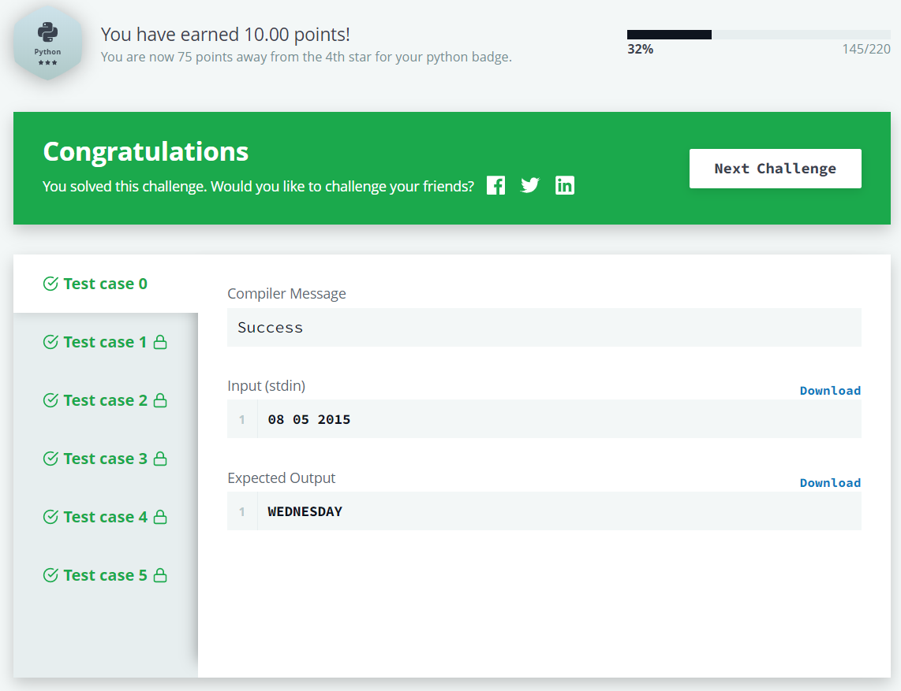

# Calendar Module

The [**Calendar Module**](https://docs.python.org/3.8/library/calendar.html#module-calendar) allows you to output 
calendars and provides additional useful functions for them.

### Task

You are given a date. Your task is to find what the day is on that date.

### Input Format

A single line of input containing the space separated month, day and year, respectively, in **MM DD YYYY** format.

### Constraints

### Output Format

Output the correct day in capital letters.

### Sample Input

    08 05 2015
    
### Sample Output

    WEDNESDAY

### Explanation

The day on August **5th 2015** was WEDNESDAY.

### Result

**ALL TEST CASES PASSSED**
