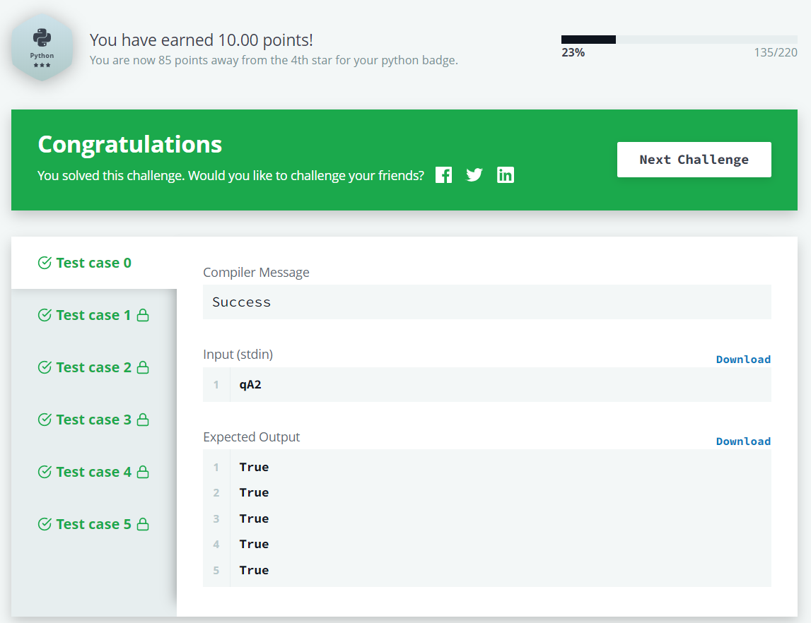

Python has built-in string validation methods for basic data. It can check if a string is composed of alphabetical characters, alphanumeric characters, digits, etc.

[str.isalnum()](https://docs.python.org/2/library/stdtypes.html#str.isalnum)

This method checks if all the characters of a string are alphanumeric (a-z, A-Z and 0-9).

    >>> print 'ab123'.isalnum()
    True
    >>> print 'ab123#'.isalnum()
    False
    
-------------------------------------------------------------------------------------

[str.isalpha()](https://docs.python.org/2/library/stdtypes.html#str.isalpha)

This method checks if all the characters of a string are alphabetical (a-z and A-Z).

    >>> print 'abcD'.isalpha()
    True
    >>> print 'abcd1'.isalpha()
    False
    
-------------------------------------------------------------------------------------

[str.isdigit()](https://docs.python.org/2/library/stdtypes.html#str.isdigit)

This method checks if all the characters of a string are digits (0-9).

    >>> print '1234'.isdigit()
    True
    >>> print '123edsd'.isdigit()
    False
    
-------------------------------------------------------------------------------------

[str.islower()](https://docs.python.org/2/library/stdtypes.html#str.islower)

This method checks if all the characters of a string are lowercase characters (a-z).

    >>> print 'abcd123#'.islower()
    True
    >>> print 'Abcd123#'.islower()
    False
    
-------------------------------------------------------------------------------------
    
[str.isupper()](https://docs.python.org/2/library/stdtypes.html#str.isupper)

This method checks if all the characters of a string are uppercase characters (A-Z).

    >>> print 'ABCD123#'.isupper()
    True
    >>> print 'Abcd123#'.isupper()
    False
    
-------------------------------------------------------------------------------------

### Task

You are given a string **S**.

Your task is to find out if the string **S** contains: alphanumeric characters, alphabetical characters, digits, 
lowercase and uppercase characters.

### Input Format

A single line containing a string .

### Constraints

### Output Format

In the first line, print True if **S** has any alphanumeric characters. Otherwise, print False.

In the second line, print True if **S** has any alphabetical characters. Otherwise, print False.

In the third line, print True if **S** has any digits. Otherwise, print False.

In the fourth line, print True if **S** has any lowercase characters. Otherwise, print False.

In the fifth line, print True if **S** has any uppercase characters. Otherwise, print False.

### Sample Input

    qA2

### Sample Output
    
    True
    True
    True
    True
    True
    
## My Result

All test case passed.
